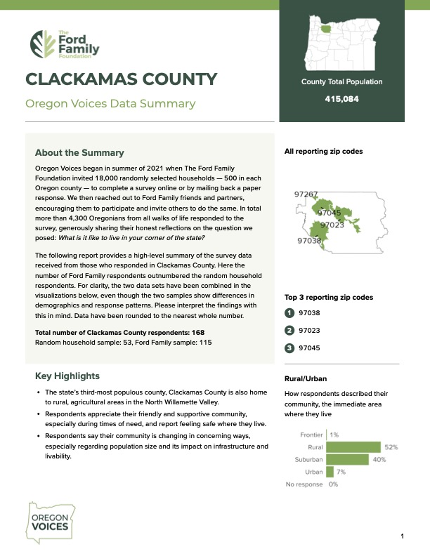
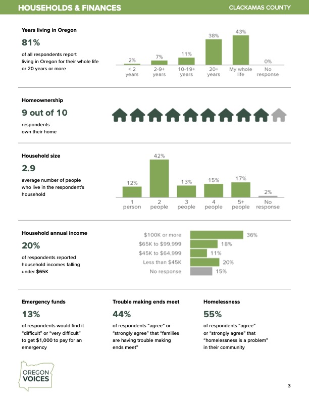

**Hi, I'm Thomas 👋**

Welcome to my Github Profile !

I'm a data everything from France (replace with analyst/scientist or whatever you prefer). I work as an independant consultant (in fact with my wife) @Kantiles.

I like to build reports by hundreds, create dashboards that won't break your mind or your computer, refine data workflow or simply help people to do a better job with data.

My toolbox includes R, Quarto, Python, JavaScript (mostly Observable) and some styling languages like HTML or CSS.

Checkout my work:

About PDF reporting:

-   [`quarto.report`](https://github.com/kantiles/quarto.report) is a Quarto extension to produce better PDF reports without using LaTeX and without to lost your sanity. It's the successor or [`pagedreport`](https://github.com/rfortherestofus/pagedreport/)

-   Some clients made our work public, see:

    -   [IA2030 for IVAC & WHO](https://publichealth.jhu.edu/ivac/2024/new-ia2030-country-profiles-to-track-immunization-achievements)
    
    
    

    -   [Oregon Voices for TFFF](https://orvoices.org/your-county/)

    
    

    -   [Housing Data Profiles for PSC Housing](https://housingprofiles.pschousing.org/)
    
    
    

On the interactive side:

-   I did some [interactive dashboard with Observable too](https://kantiles.github.io/demo_isd/main.html)

-   I also made some [data exploration](https://kantiles.github.io/prix-ehpad-web/) with MapLibre and JS

If you came here after UseR 2024 of the Rencontres R, here are my talks :

-   [UseR 2024](https://github.com/tvroylandt/user_2024_parametrized_reporting) about parametrized reporting
-   [Rencontres R 2024](https://github.com/tvroylandt/rr_2024) about Excel data cleaning
-   [Rencontres R 2021](https://github.com/tvroylandt/pagedown_rr2021) about creating a template with {pagedown}

On my freetime I like to run and take care of my children (or just trying to survive to this mess they create everyday).
